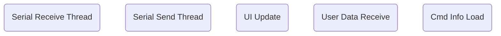

# software design Doc  
## Feature  
  
- [ ] asyn serial read/write  
- [ ] cmd load  
  
## Arch  
  

```mermaid
graph TD
A(Serial Receive Thread)
B(Serial Send Thread)
C(UI Update)
D(User Data Receive)
E(Cmd Info Load)
```  
